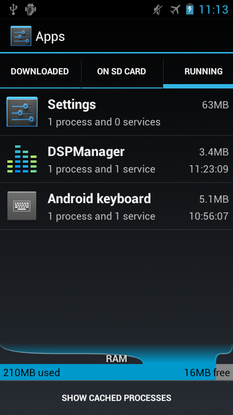

I have an old [OG Motorola Droid](https://en.wikipedia.org/wiki/Motorola_Droid), which originally came with Eclair. It's a nice device to develop and debug Android apps on, as it provides a more-or-less accurate representation of what an underpowered device will look like when seeing how well your app performs. This is, in my opinion, an important but often neglected aspect of app development that often goes ignored. And when performance is ignored, apps get bloated and compete for resources, which is something that you rarely want to happen to your phone.

However, as times change and Android as a platform evolves, my old Motorola Droid has been unable to be useful as a test device in this manner. This is largely in part to [Ice Cream Sandwich and up accounting for 99% of all Android users](http://www.droid-life.com/2017/03/07/android-distribution-updated-march-2017-whoa-settle-nougat/). Which I think either says something to Google doing a good job rolling out Ice Cream Sandwich, or just provides some perspective as to how quickly time can fly. Either way though, with custom ROMs the OG Droid can actually get to Ice Cream Sandwich and run it somewhat smoothly.



The issue that gets hit very quickly, however, is RAM/memory consumption. The Motorola Droid only shipped with 256MB of RAM! That's ridiculously low by today's standards, and it shows in the above screenshot. Just running ICS prevents the Droid from being able to run a large number of apps, even if they would otherwise support it.

Normally when I make an Android app, I try to target as low of an API as possible. Since the apps I've made up until now haven't been too complicated, this hasn't been difficult to do. As I grow as a programmer and app developer, however, and as less and less Android users have Gingerbread or below, I find myself starting to take advantage of newer APIs that were introduced in Ice Cream Sandwich. And this puts me in an unfortunate position, as even though my Droid can run ICS, it still can't be used to debug the app I'm working on without crashing with out of memory errors.

Unlike my Galaxy Nexus, my Droid is still kicking. In addition to this, the more underpowered it is, the better a candidate it is to test performance on! If only it had a bit more RAM!

So this led me to my solution... Which was more straightforward than I thought. Android devices don't use [swapfiles or swap disks](https://en.wikipedia.org/wiki/Swap_(computer_programming), likely as they don't really have much use in the mobile space, where if memory is starved apps should be killed rather than using the disk for more memory. However, all of the low-level Linux tools are still present to enable swap!

The below steps require adb and a rooted Android phone, but will create a swapfile and allow the device to utilize more memory. **Be aware that you perform these steps at your own risk**, and that frequently reading and writing to the sdcard or flash storage **decreases the life of the card/device**. This is a pretty situational thing to want to do, and I wouldn't recommend it as a daily driver.

First open a shell session either on your device directly or via ```adb shell```

The first thing that we're going to want to do is create a large empty swap file. You can also use a swap partition, but Android does not come with any built-in partioning utilities. This file can be created with [dd](http://man7.org/linux/man-pages/man1/dd.1.html), and here I am making it 256MB (500,000 counts of 512 bytes) in /sdcard/swapfile.
```
dd if=/dev/zero of=/sdcard/swapfile bs=512 count=500000
```

Once the empty file is created, you can mount it as a loopback device using [losetup](http://linuxcommand.org/man_pages/losetup8.html). This presents the file as a device under /dev that we can treat as if it were a swap partition.
```
losetup /dev/block/loop0 /sdcard/swapfile
```

You can verify that this was properly done by running ```df```, and confirming that the device is setup. Next, it's time to make/format the "partition" as swap, and then switch it on:
```
mkswap /dev/block/loop0
swapon /dev/block/loop0
```

At this point, the Android device is now able to use more memory! Unfortunately, the swap doesn't show up in Settings under the Apps Memory section, but it can be verified by running ```free```  before and after running ```swapon```.

It seems Android will still be quick to kill backgrounded applications (as if it is still starved for memory), but the app that I was debugging is now able to run without crashing, which is all that I had set out to do with this task. 

I was pleased to see that this wasn't any more complicated than it would be on a computer, and while it is a corner case, is just another reason why it's nice to be able to root your Android device.


A keyboard! How dated!
