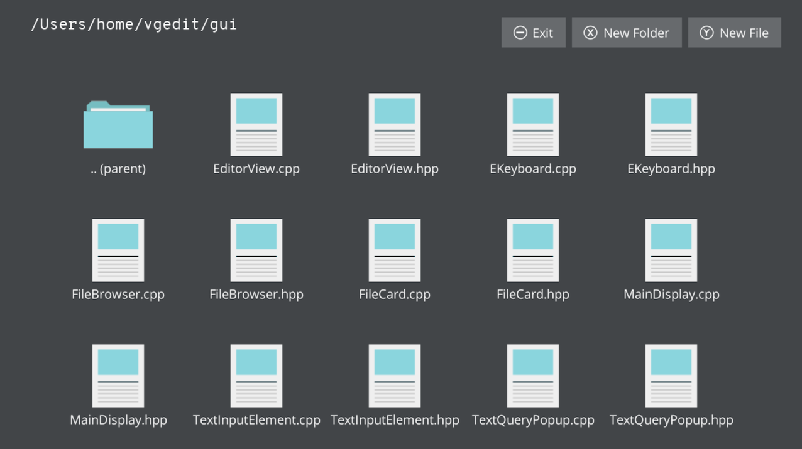
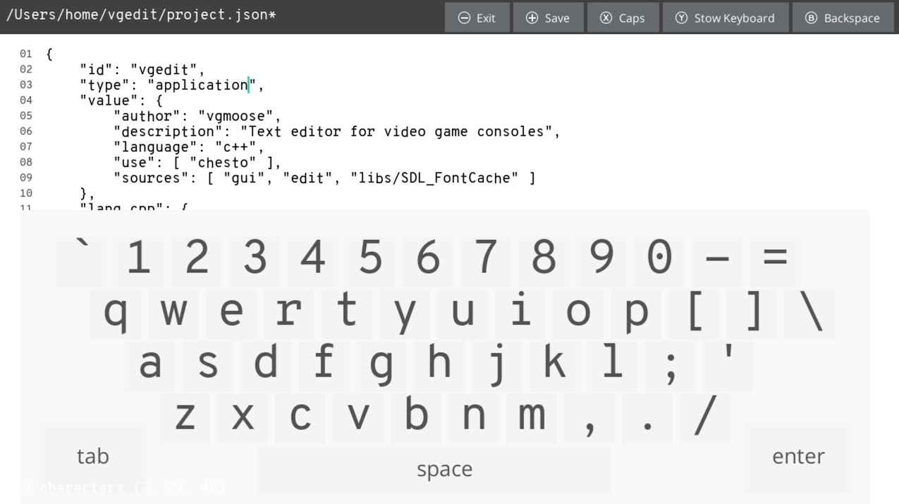

A little bit more than a year ago (oops somehow it's June?) I made a homebrew app for called **vgedit**, with the goal being the ability to edit text files directly on the Switch / Wii U.

The app was made mostly for personal use cases, but I now have a major update to its functionality, which I will now tell you all about!

**Download:** https://github.com/vgmoose/vgedit/releases
Available under the GPLv3 license

This update allows vgedit to handle much larger files, adds line number and  cursor fixes, usb keyboard support, and other features/bugfixes!

## Editing Bigger Files!

It's now using the [SDL_FontCache](https://github.com/grimfang4/SDL_FontCache) library by grimfang4 for rendering the body text. I discovered this via the following [SO post](https://stackoverflow.com/a/29725751) by the author. Adding this functionality, and also changing the way that the line in the file are rendered, vgedit is now capable of loading much, much larger files than it used to.

This is on the order of being able to edit several MB files no problem in the update, compared with barely being able to handle a KB in the orignal! It also has improved line wrapping and line numbers in order to actually tell where you are in file, plus find+replace to find what you're looking for faster.

In addition to the file/rendering improvements, the cursor is now a different color that it can be more easily seen, and when you start typing it jumps to the cursor position to make it easier (kinda like how a computer would do it).

## USB Keyboard Input

Another major change was something that I hadn't intended to do, but it made debugging on a PC easier, and that's USB keyboard support! Instead of doing any sort of sane keyboard input integration, this is actually all hooked up by mapping SDL KeyEvents to the virtual keys that on the on screen keyboard. The heart of the logic for this is pretty straight forward, and just goes through all the known keys in the keyboard and updates it's selected row/index if it matches the current key press event. Here's the [main loop](https://github.com/vgmoose/vgedit/blob/3faf3e981856e71db711c8460933e9d9fec0edf9/gui/EKeyboard.cpp#L323-L342), and the [key mapping setup](https://github.com/vgmoose/vgedit/blob/3faf3e981856e71db711c8460933e9d9fec0edf9/gui/EKeyboard.hpp#L37-L42).

The result of this is that the keyboard cursor visually moves to where the key is on the on-screen keyboard, and you can see yourself typing. You can also press the Alt button to hide the keyboard but stay in Insert mode. A lot of the functionality between the two modes feels vim-esque but with a lot less power.

## Undo/Redo Support

Finally, the last feature added was undo/redo, which is nice to have since on a non-standard device like the Switch you are more likely to fat finger something or accidentally hit the wrong button than you would on PC. This is implemented with a vector of the diffs between each edit made. The structure of this data looked [like this](https://github.com/vgmoose/vgedit/blob/3faf3e981856e71db711c8460933e9d9fec0edf9/edit/Editor.hpp#L13-L17).

[This function](https://github.com/vgmoose/vgedit/blob/3faf3e981856e71db711c8460933e9d9fec0edf9/edit/Editor.cpp#L71-L79) is called to append to the vector the info of the characters that have been inserted/removed, the position where it happened, and whether or not this action was a delete or redo. For undos of deletions, we want to do an insert, and vice-versa for redo's of inserts– need deletes.

This is handled by this [common history function](https://github.com/vgmoose/vgedit/blob/3faf3e981856e71db711c8460933e9d9fec0edf9/gui/Toolbar.cpp#L20-L52), which takes the `isDelete` info and xor's it with whether or not we're doing an undo. This means there's a 2x2 grid of the results here, and it's leveraging the fact that they are inverse operations of each other. This function is invoked [like this](https://github.com/vgmoose/vgedit/blob/3faf3e981856e71db711c8460933e9d9fec0edf9/gui/Toolbar.cpp#L142-L154) by the buttons, using fancy std::functions and [Chesto](https://gitlab.com/4tu/chesto) elements.

## One more thing
A bit of straightforward [Find... functionality](https://github.com/vgmoose/vgedit/blob/3faf3e981856e71db711c8460933e9d9fec0edf9/gui/Toolbar.cpp#L157-L187) was added that jumps to the next occurence of the search query. This came alongside a text-input pop up element made in Chesto that takes callbacks and works in an all-too-JavaScripty way (which is great!)

I do have to wonder about the audience of this tool. I'm frequently in a position where I don't have any network, or I can't get to a computer and remove my SD card, and find myself needing to edit just one file quickly. It's also very useful for editing save file backups on the fly to re-inject (which is [apparently not ok in Japan](https://ekgaming.com/2019/01/04/japan-makes-console-modding-and-save-game-editors-illegal/)).

It's nice to have more bugs squished though, and the added stability allows me to feel better about it's functionality. Hopefully in the future it can be ported to other SDL2 platforms as well!

## Changelog

### New Features:
- Line numbers along left side
- Can load much larger text files
    - Uses SDL_FontCache for improved performance 
- New menu bar while editing file
    - Find and jump to position within file
    - Undo/redo history state tracking
- Create new file or folder while browsing
- USB Keyboard support
    - Only in Insert mode (when on-screen keyboard is showing)
    - Can press Alt to toggle on-screen keyboard

### Bugfixes:
- Proper line wrapping for long lines
- Properly affix cursor within text file
- File/folder list is alphabetized now
- Better support for tabs within file
- Scroll to cursor position when typing
- Unsaved changes need confirmation when exiting
- Allow copy/paste between two files

### More Screenshots:

